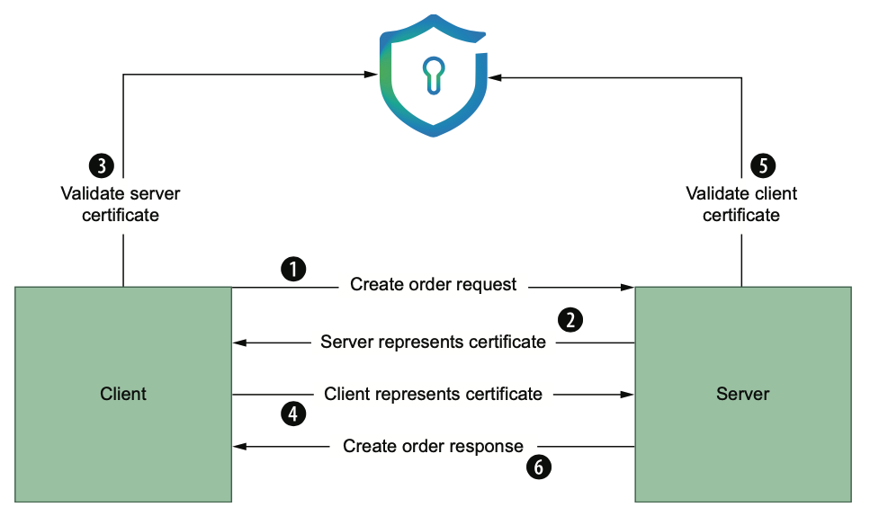

# Certificates

## Certificate creation (option 1)

``` shell
openssl req -x509 -newkey rsa:4096 -keyout key.pem -out cert.pem -days 365 -nodes \
-subj "/C=CO/ST=BOGOTA/L=BOGOTA/O=Software/OU=Microservices/CN=localhost/emailAddress=sjulian9409@gmail.com" 
```

- -x509 : Generate an X.509 certificate, the standard used in TLS, instead of a request for a certificate.
- -newkey rsa:4096 : Create a new certificate that uses the RSA asymmetric encryption algorithm, with a key size of 4096 bits (the more bits, the harder to attack).
- -keyout key.pem : The file to write the private key to. This file must always be kept secret from everyone but the owner of the certificate.
- -out cert.pem : This is the file that the X.509 certificate should be written to, which contains the public key. Clients that connect to your service will get access to this public certificate while establishing a TLS connection.
- -days 365 : The number of days for which this certificate should be valid (defaults to 30).
- -nodes : Do not encrypt the private key with a password.

## Create CA

``` shell
openssl req -x509 \
-sha256 \
-newkey rsa:4096 \
-days 365 \
-keyout ca-key.pem \
-out ca-cert.pem \
-subj "/C=CO/ST=BOGOTA/L=BOGOTA/O=Software/OU=Microservices/CN=localhost/emailAddress=sjulian9409@gmail.com" -nodes

# Read CA Cert
openssl x509 -in ca-cert.pem -noout -text
```

## Create Server Certificate

### Create Signing request for Server Certificate
```shell
openssl req -newkey rsa:4096 -keyout server-key.pem -out server-req.pem -subj "/C=CO/ST=BOGOTA/L=BOGOTA/O=Microservices/OU=PaymentService/CN=localhost/emailAddress=sjulian9409@gmail.com" -nodes -sha256
```

### Sign the certificate with CA's private key
```shell
openssl x509 -req -in server-req.pem -days 60 -CA ca-cert.pem -CAkey ca-key.pem -CAcreateserial -out server-cert.pem -sha256
```
#### Optional add SAN
Create a file named `server-ext.cnf` with the next content, this will specify the SAN

```
subjectAltName=DNS:*.microservices.dev,DNS:*.microservices.dev,IP:0.0.0.0
```

Then sign the certificate, the file created will pass as the `-extfile` parameter

``` sh
openssl x509 -req -in server/server-req.pem -days 60 -CA ca/ca-cert.pem -CAkey ca/ca-key.pem -CAcreateserial -out server/server-cert.pem -extfile server/server-ext.cnf -sha256
```

### Verify server certificate
```shell
openssl x509 -in server-cert.pem -noout -text
```

## TLS Flow

As we want to create a connection using TLS this communication will follow the next diagram, just until step 3, from step 4 - 6 is mTLS



Follow the next steps to achieve TLS communications after certificates creation

### Add the Server certificate and key to Envoy

```yml
- transport_socket:
    name: envoy.transport_sockets.tls
    typed_config:
        "@type": type.googleapis.com/envoy.extensions.transport_sockets.tls.v3.DownstreamTlsContext
        common_tls_context:
        tls_certificates:
            certificate_chain: # Setting server certificate
            filename: /certs/server-cert/server-cert.pem
            private_key: # Setting server key
            filename: /certs/server-key/server-key.pem

```

### Add the CA in the Client
At this moment the client is the `netshoot` container, so sh into it, then copy the CA certificate `ca-cert.pem` where the ca-certificates are stored `/usr/local/share/ca-certificates` end it with `.crt`

```shell
vi /usr/local/share/ca-certificates/ca-cert.crt
# You may need SUDO or SU
update-ca-certificates
```

### Testing The CA
You can verify if this worked by looking for the certificate that you just added in `/etc/ssl/certs/ca-certificates.crt`, You can also use OpenSSL's s_client by trying to connect to a server that you know is using a certificate signed by the CA that you just installed.

``` shell
# List all the certificates on a file
cat /etc/ssl/certs/ca-certificates.crt | openssl crl2pkcs7 -nocrl -certfile /dev/stdin | openssl pkcs7 -print_certs -text -noout

# Recomended
# You may need SUDO or SU
openssl s_client -connect localhost:8443 -CApath /etc/ssl/certs
```

